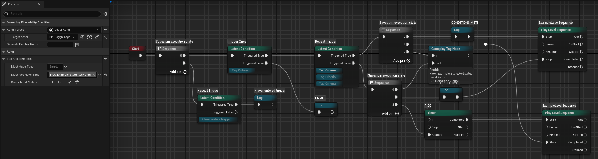

# GameplayFlow Plugin

## Overview
GameplayFlow is an Unreal Engine plugin that provides a flexible and powerful flow control system for gameplay mechanics. It allows developers to create complex gameplay sequences and conditions using a node-based approach utilising the gameplay ability system.

## Features
- Node-based gameplay flow control system
- Conditional gameplay logic
- Integration with Unreal Engine's Ability System
- Live debugging of flow nodes
- Custom flow conditions framework
- Blueprint-friendly architecture

## Requirements
- Unreal Engine 5.4
- C++ project support
- Gameplay Ability System (for ability-related features)
- [FlowGraph plugin](https://github.com/MothCocoon/FlowGraph) - 5.4 version (commit `3c139e6f3eccbd01ad0f2960d3a33f957e777427` - yet to be updated to most recent 5.4 release)
- [Sky Ability Plugin](https://github.com/Zeploc/SkyAbilitySystem)

## Core Components

### Flow Nodes
The plugin is built around a node-based system where each node represents a specific gameplay action or condition:

- **Condition Nodes**: Base class `UGameplayFlowCondition`
  - Used to create conditional logic in gameplay flows
  - Extensible through inheritance
  - Blueprint-exposed functionality

### Ability System Integration
- `UGameplayFlowAbilityCondition` provides direct integration with Unreal Engine's Gameplay Ability System
- Allows for ability-based flow control and conditions

## Usage

### Creating Flow Conditions
1. Create a new condition by inheriting from `UGameplayFlowCondition`
2. Implement the required condition logic
3. Use the condition in your gameplay flow graphs

### Ability System Integration
To use with the Gameplay Ability System:
1. Use `UGameplayFlowAbilityCondition` for ability-related conditions
2. Configure ability conditions through blueprints or C++
3. Connect conditions to your gameplay flow

## License
Copyright Skyward Studios, Inc. All Rights Reserved.